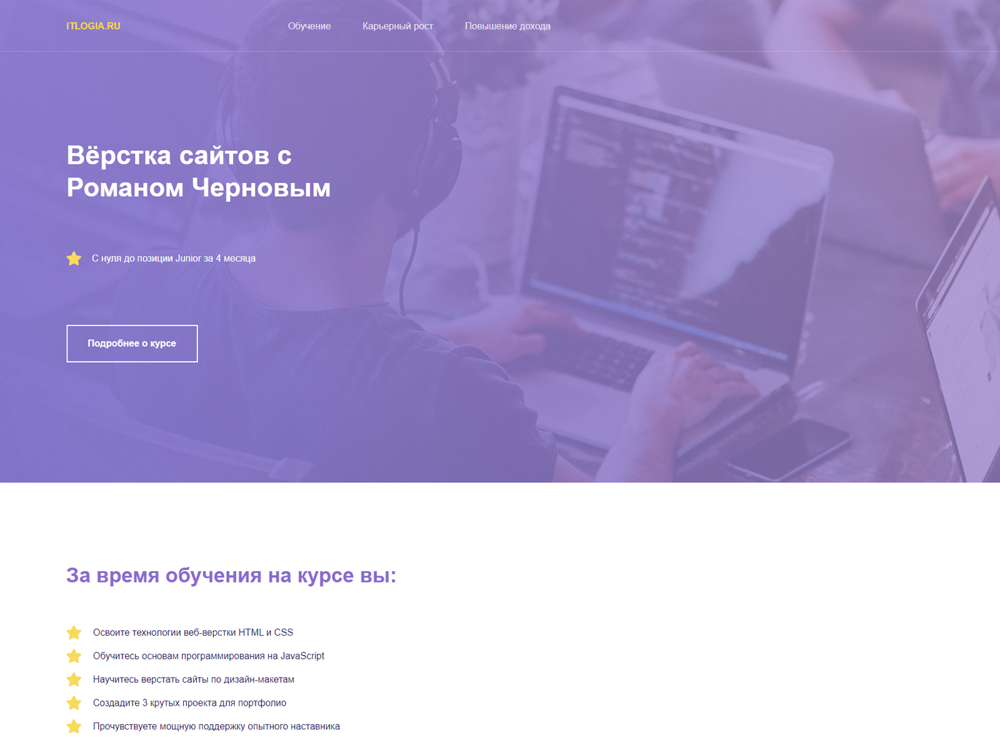

# Одностраничный сайт (лендинг)

Самостоятельный проект в рамках обучения на курсе "Профессия Frontend-Разработчик" в онлайн-школе "Айтилогия".

## Внешний вид

## Выполненные задачи:
- Создание статического одностраничного сайта;
- Практика использования средств HTML (блоки, списки);
- Использование элементов семантической верстки;
- Практика применения CSS-стилей для вёрстки в соответствии с макетом.

## Используемые технологии:
* HTML
* CSS